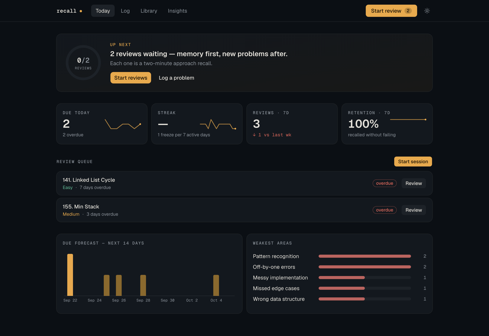
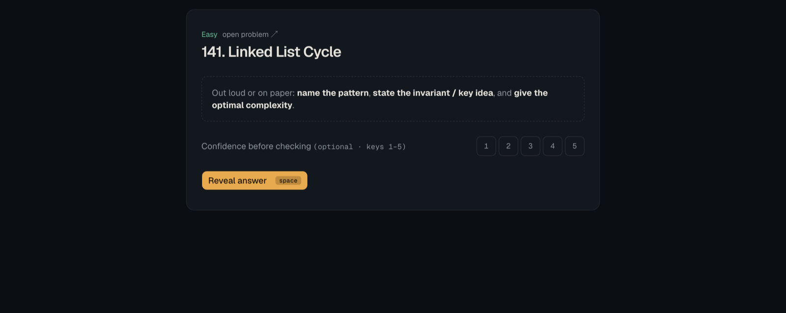
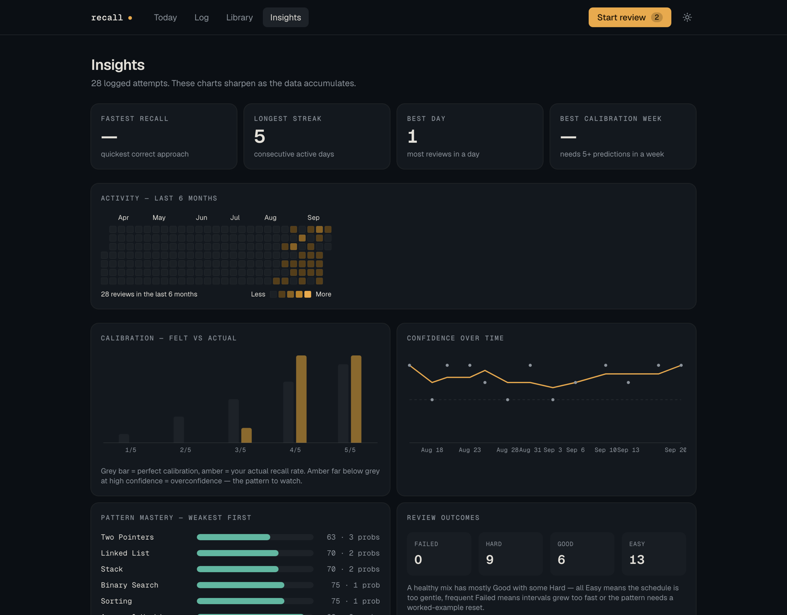
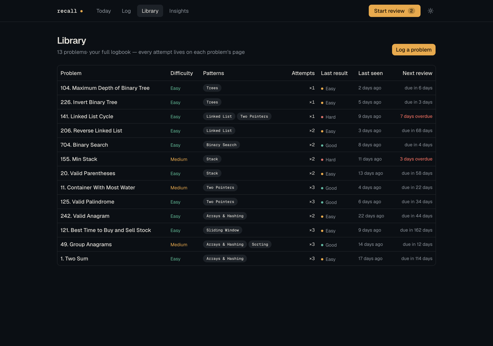

<h1 align="center">Recall</h1>

<p align="center">
  <strong>A memory engine for LeetCode practice.</strong><br>
  Most people re-solve problems they already know and never revisit the ones
  that actually broke them. Recall fixes that by scheduling reviews from
  <em>how the solve really went</em> — not from how you felt about it afterwards.
</p>

<p align="center">
  <a href="https://github.com/ShreeBohara/recall-leetcode/actions/workflows/ci.yml">
    
  </a>
  
  
  
  
</p>



## The idea

A flashcard app asks *"did you remember this?"* and takes your word for it.
That question is useless for algorithms, because the thing you need to recall
isn't a fact — it's **the approach**: which pattern applies, why it works, and
what it costs.

So Recall does two things differently.

**The grade is derived, not self-reported.** You finish a tutoring session and
paste (or auto-log) a summary of what happened: hints used, how fast the
approach came, confidence before and after, what went wrong. Recall turns those
signals into an [FSRS](https://github.com/open-spaced-repetition/ts-fsrs) grade
itself. You never rate your own memory, because people are bad at it — and the
calibration chart exists to prove exactly how bad.

**A review is a recall, not a re-read.** The answer ships hidden. You say the
pattern, the invariant and the complexity out loud first, *then* reveal. The
recommender is built around the same rule: when it suggests your next problem it
deliberately withholds the pattern, because recognising it is the skill being
trained.

<p align="center">
  
</p>

## The loop

1. Solve a problem with your Claude tutor. The session ends with a Problem Log.
2. **Log it** — paste it, or let Claude call the MCP tool directly. ~15 seconds.
3. Each morning **Today** shows what's due. Two minutes per card: name the
   pattern, state the invariant, give the complexity, reveal, grade honestly.

Due dates also mirror onto your calendar, so the queue finds you even when you
don't open the app.

## Under the hood

The parts worth reading, if you're here to look at the code:

| | |
|---|---|
| **Grade derivation** | [`src/lib/fsrs.ts`](src/lib/fsrs.ts) — maps solve signals to an FSRS rating; the tutor's suggested grade wins when present, otherwise it's inferred |
| **Answer-hiding as an invariant** | [`src/lib/recommend.ts`](src/lib/recommend.ts) — `NextAction.solve` carries *no* pattern fields, because it crosses into a client component |
| **Two doors, one funnel** | [`src/app/api/mcp/route.ts`](src/app/api/mcp/route.ts) and the paste form both call the same `saveParsedSummary`, so the MCP tool and the web UI can't drift into two different write paths |
| **One schema, two drivers** | [`src/db/index.ts`](src/db/index.ts) — libSQL over HTTP when deployed, better-sqlite3 locally, chosen at runtime |
| **Day math is the product** | `TZ` is pinned at startup and every boundary goes through one helper; a streak that silently shifts by a day is a broken app |
| **Verified backups** | [`scripts/backup.ts`](scripts/backup.ts) — rebuilds a real SQLite file, then reopens it and proves it before calling it a backup |



The calibration chart is the honest one. Grey is perfect calibration, amber is
your actual recall rate at each confidence level. Amber sitting below grey at
4/5 and 5/5 means you're overconfident — which is the failure mode that makes
people skip the reviews they most need.

## Run it

```bash
npm install
npm run db:migrate     # create/update the schema from drizzle/
npm run seed:lists     # one-time: seed the problem list and make it active
npm run dev            # http://localhost:3000
```

Works immediately on local SQLite with no accounts and no cloud setup.

Skip `seed:lists` and there is no active list, so the recommender has nothing
to draw from and "what should I solve next" stays empty.

> **These follow your `.env`, not the filename above.** `drizzle.config.ts`
> loads dotenv, so if `TURSO_DATABASE_URL` is set (see
> [Deploy](#deploy-vercel--turso)) then `db:migrate`, `db:push` and
> `import:sheet` target the **deployed** database, not `data/recall.db`. Unset
> the `TURSO_*` vars for a purely local run.

`npm run import:sheet` is a one-time historical import from the original Google
Sheet; it is not part of a normal setup.

## Tests

```bash
npm test               # parser, identity ladder, FSRS scheduler, timezone
```

No test runner — each suite is a plain `tsx` script that exits non-zero on
failure. The DB-backed suites seed a scratch SQLite file in `os.tmpdir()` and
never touch a real database. All four run in CI
(`.github/workflows/ci.yml`) alongside lint, typecheck, `drizzle-kit check`
and a production build.

Each suite covers something that fails *silently* rather than loudly — the
only kind of bug that survives in a single-user app:

| Suite | Guards against |
|---|---|
| `test:parser` | a misread log writing the wrong FSRS grade |
| `test:identity` | the lcSlug → slug → number → bare-slug ladder drifting apart |
| `test:fsrs` | the scheduler quietly returning the wrong next date |
| `test:tz` | day-boundary math shifting when `TZ` is preset by the host |

One thing `test:fsrs` documents rather than enforces: `maximum_interval: 365`
is a *soft* cap. `LongTermScheduler.next_interval` clamps each grade and then
enforces `again < hard < good < easy`, so a fully saturated card settles at
365/366/367/368 days rather than 365. Harmless, but surprising if unexplained.

## The Problem Log template

Anything close to this parses perfectly (free-form text also works, best-effort;
set `ANTHROPIC_API_KEY` to parse messy summaries with Claude):

```
## Problem Log — 49. Group Anagrams
URL / Difficulty / Patterns: https://leetcode.com/problems/group-anagrams/ · Medium · arrays-hashing
Solved: with 2 hints     Recall speed: slow
Confidence: before 2/5 → after 3/5     Time: approach 12 min · code 20 min
Fundamentals missing: definition of anagram
Issues: wrong pattern; code was messy
Brute force: compare every pair — O(n²k) / O(1)
Optimal: bucket by sorted-string key — O(nk log k) / O(nk)
Key insight: all anagrams share one canonical form
Tips: char-count tuple avoids the sort
Revise: yes — pattern recognition still weak
Suggested grade: hard — needed hints for the invariant
```

Grades: `again` (couldn't do it) · `hard` (hints/slow/low confidence) ·
`good` (solo with friction) · `easy` (instant + optimal). The tutor's
suggested grade wins; otherwise Recall derives it from the signals.

## MCP — let the tutoring chat log problems itself

Recall is also an MCP server at `/api/mcp`. Tools: `get_next_action` (call it
first — it returns the day's plan), `add_problem`, `get_due_reviews`,
`log_review`, `get_stats`, `get_weekly_report_data`, `save_coach_report`. With
the dev server running, connect Claude Code:

```bash
claude mcp add --transport http recall http://localhost:3000/api/mcp --header "Authorization: Bearer dev"
```

(Replace `dev` if you set `MCP_TOKEN`.) Then at the end of a tutoring session,
say **"log it"** — Claude calls `add_problem` directly, zero copy-paste. For
claude.ai custom connectors the endpoint must be publicly reachable, i.e.
after deployment.

`get_next_action` omits the recommended problem's pattern from its reply on
purpose: tool results are visible to the user in most MCP clients, and the
pattern is the answer.

The tutor prompt in [docs/tutor-prompt.md](docs/tutor-prompt.md) is written to
use these tools when available and fall back to the paste template otherwise.

## Library and calendar



Every problem keeps its approaches, key insight and full review journal. The
detail page reuses the review player's reveal, so browsing your own notes
doesn't spoil a problem still sitting in the queue.

For the calendar, subscribe once in Google Calendar: **Other calendars → From
URL** → `http://<host>:3000/api/calendar/dev.ics` (set `CALENDAR_TOKEN` to
change the secret). Overdue reviews appear on today. Google only refreshes
subscribed feeds every 12–24h, which is fine for multi-day intervals; Apple
Calendar refreshes faster. While the app only runs on localhost the feed can't
be reached by Google's servers — use the in-app Today queue as primary (it is
anyway), or deploy first.

## Backups

```bash
npm run backup                          # verified snapshot
npm run backup:verify backups/<file>.db # re-verify an existing one
```

A snapshot is only a backup if it opens and makes sense, so the script reopens
what it wrote and checks integrity, foreign keys, exact row counts, and the
domain invariants that decide whether the data is actually restorable. Anything
that fails is renamed `*.FAILED.db` rather than kept — a backup that looks like
protection but isn't is worse than none. See
[`deploy/backup/README.md`](deploy/backup/README.md) for scheduling and the
restore drill.

## Environment (.env)

| Variable            | Default             | Purpose                                       |
| ------------------- | ------------------- | --------------------------------------------- |
| `DATABASE_PATH`     | `data/recall.db`    | SQLite location                               |
| `CALENDAR_TOKEN`    | `dev` — see below   | Secret in the ICS feed URL                    |
| `MCP_TOKEN`         | `dev` — see below   | Bearer token for the MCP endpoint             |
| `ANTHROPIC_API_KEY` | —                   | Enables AI parsing of free-form summaries     |
| `PARSE_MODEL`       | Haiku 4.5           | Model for AI parsing                          |
| `RECALL_USER_ID`    | `shreet`            | Row owner (multi-user later)                  |
| `APP_TIMEZONE`      | `America/Los_Angeles` | Timezone all day math uses (streaks, "due today") |
| `APP_URL`           | Vercel URL, else localhost | Base URL the MCP tools put in their replies |

> The `dev` fallback for `CALENDAR_TOKEN` and `MCP_TOKEN` is **local-only**. It
> is revoked the moment `APP_PASSWORD` is set or `NODE_ENV=production`, because
> those two routes are exempt from the login gate and a shared default would
> leave them open. On a gated instance, set both explicitly or the ICS feed and
> the MCP endpoint return "Not found" / 401. See `src/lib/secrets.ts`.
>
> Set `APP_TIMEZONE`, not `TZ`, to change the app's day boundary — `TZ` is
> overwritten at startup (`src/db/index.ts`) because the deploy platform
> presets it to UTC.

## Deploy (Vercel + Turso)

The app runs on local SQLite with zero setup; setting `TURSO_DATABASE_URL`
switches it to [Turso](https://turso.tech) (hosted libSQL — same schema, same
queries). Deployed instances should also set `APP_PASSWORD`, which activates
the login gate on every page and API (the MCP endpoint and ICS feed keep their
own tokens).

One-time, interactive (browser OAuth — only steps a human can do):

```bash
turso auth signup
```

```bash
npx vercel login
```

Then, from `recall/`:

1. `sqlite3 data/recall.db "PRAGMA wal_checkpoint(TRUNCATE);"` then
   `turso db create recall --from-file data/recall.db` — creates the cloud DB
   *with all existing data*.
2. `turso db show recall --url` and `turso db tokens create recall` → the two
   `TURSO_*` values.
3. `npx vercel link`, add env vars (`TURSO_DATABASE_URL`, `TURSO_AUTH_TOKEN`,
   `APP_PASSWORD`, `CALENDAR_TOKEN`, `MCP_TOKEN`, optionally
   `ANTHROPIC_API_KEY`), then `npx vercel --prod`.

After deploy:

- **Calendar**: Google Calendar → Other calendars → From URL →
  `https://<app>.vercel.app/api/calendar/<CALENDAR_TOKEN>.ics` (now reachable
  by Google's servers, so it actually syncs).
- **MCP from claude.ai**: Settings → Connectors → Add custom connector →
  `https://<app>.vercel.app/api/mcp` with header
  `Authorization: Bearer <MCP_TOKEN>`.
- **Note**: local SQLite and Turso are now separate databases. Treat the
  deployed app as the source of truth; for cloud-backed local dev, put the
  `TURSO_*` values in `.env`.

## Architecture notes

- Next.js 16 App Router · Tailwind v4 + shadcn/ui (Base UI) · Drizzle over
  Turso (libSQL) in deployment, better-sqlite3 locally · ts-fsrs (FSRS-6,
  long-term mode, retention 0.9, max interval 365d, first interval floored at
  2 days).
- Every *user-owned* table carries `user_id`, so multi-user is a migration
  rather than a rewrite. The three that don't are not user-scoped:
  `list_items` (owned by its list), `problem_concepts` (a join table), and
  `problems_catalog` (a shared cache of public LeetCode metadata).
- A re-solve of an existing problem logs a review against the existing record —
  never a duplicate row. Identity resolves lcSlug → slug → number → exact bare
  slug, in one place (`findProblem` in `src/lib/data.ts`).
- Schema changes go through migration files: edit `src/db/schema.ts`, then
  `npm run db:generate` to emit reviewable SQL into `drizzle/`, then
  `npm run db:migrate` to apply it. `drizzle/0000_baseline.sql` is a baseline —
  it describes the schema as it already existed when migrations were adopted,
  and is recorded as applied, so it never re-runs against a live database.
- `npm run db:push` still exists but is for throwaway/scratch databases only.
  Against a database with real rows, push resolves a column rename or a new
  `NOT NULL` column without a default by **recreating the table**, with no SQL
  to review and nothing to roll back to. Use `db:generate` + `db:migrate`.
- Roadmap: concept-level scheduling (the `concepts` / `problem_concepts` tables
  are declared and waiting for it); sibling-problem substitution on mature cards.

## License

[MIT](LICENSE) © Shree Bohara

---

<p align="center"><sub>
Screenshots use a generated sample history so the charts are legible.
Built as a personal tool — the design decisions assume one user who is honest with themselves.
</sub></p>
